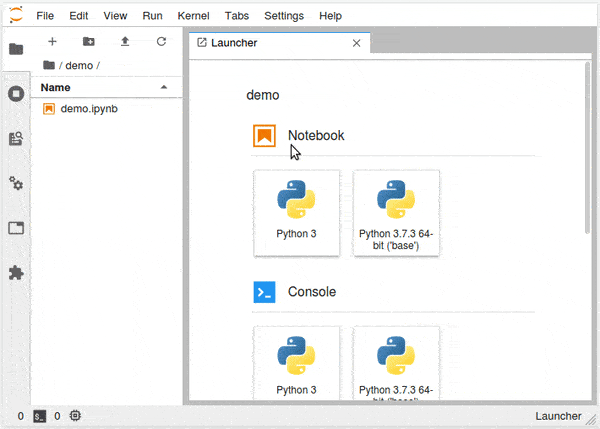

# autoplay

A Jupyter Lab extension to automatically run and/or hide cells when opening a notebook.



## Requirements

* JupyterLab >= 2.0

## Install

```bash
jupyter labextension install autoplay
```

## How to use

Find more details about how to use the extension in this [blog post](https://borgniet.com/?p=240).

TLDR:
1. Open or create a notebook
2. Edit it using `Set notebook autorun config` in the `command` pannel 
3. Save the notebook

### Configure the notebook manually
The extension reads the notebook's metadata to know if it should be ran on opening it. Which mean you can manually or programmatically edit the following metadata:
```
{
  [...]
  "metadata": {
    "autoplay": {
        "autoRun": true,
        "hideCodeCells": true
    }
  }
}
```

- *autoRun*: will run all the code cells in the notebook after opening it
- *hideCodeCells*: will hide code cells after opening it

## Warning
Be careful if you're using this extension as malicious code could be ran and hidden automatically. Make sure you and your users know what you're doing.

## Contributing

### Development install

Note: You will need NodeJS to build the extension package.

The `jlpm` command is JupyterLab's pinned version of
[yarn](https://yarnpkg.com/) that is installed with JupyterLab. You may use
`yarn` or `npm` in lieu of `jlpm` below.

```bash
# Clone the repo to your local environment
# Change directory to the autoplay directory
# Install package in development mode
pip install -e .
# Link your development version of the extension with JupyterLab
jupyter labextension develop . --overwrite
# Rebuild extension Typescript source after making changes
jlpm run build
```

You can watch the source directory and run JupyterLab at the same time in different terminals to watch for changes in the extension's source and automatically rebuild the extension.

```bash
# Watch the source directory in one terminal, automatically rebuilding when needed
jlpm run watch
# Run JupyterLab in another terminal
jupyter lab
```

### Uninstall

```bash
pip uninstall autoplay
```
